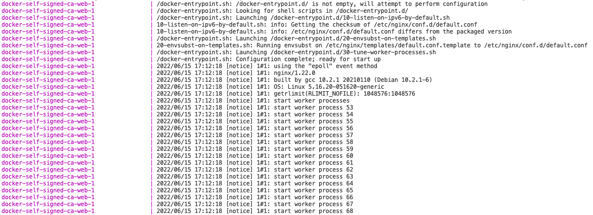
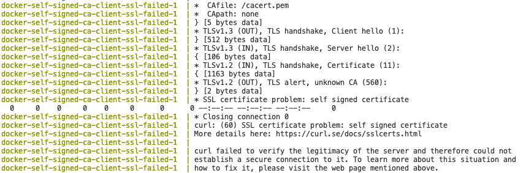
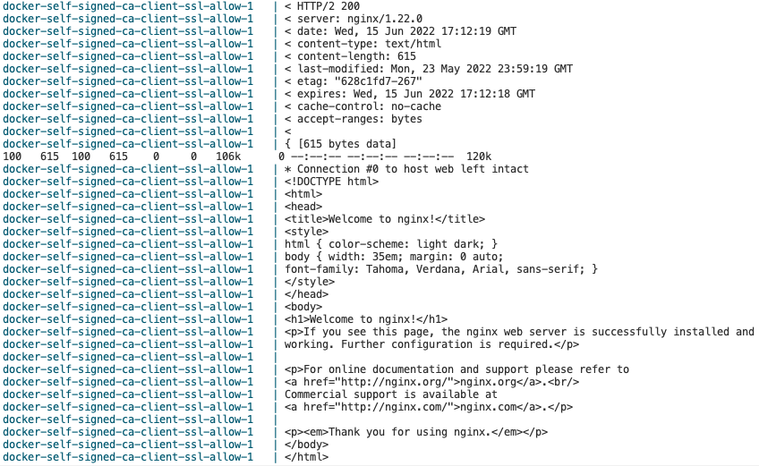
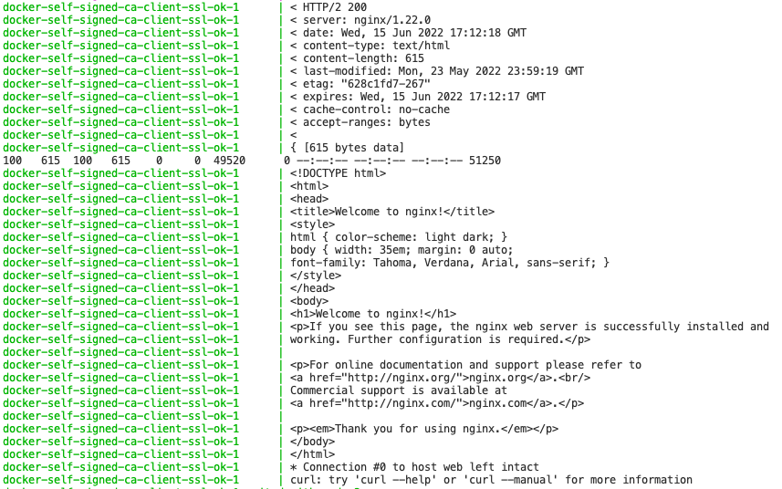

# Dockefile use self signed ca

## 建立 self certificate
### 建立 CA
```
openssl genrsa -out server/nginx/cert/rootCA.key 4096
openssl req -x509 -new -nodes -key server/nginx/cert/rootCA.key -sha256 -days 3560 -out server/nginx/cert/rootCA.crt -config ssl.conf
```

### 建立 Server certificate
```
openssl genrsa -out server/nginx/cert/server.key 2048
openssl req -new -sha256 -key server/nginx/cert/server.key -out server/nginx/cert/server.csr -config ssl.conf
openssl x509 -req -in server/nginx/cert/server.csr -CA server/nginx/cert/rootCA.crt -CAkey server/nginx/cert/rootCA.key -CAcreateserial -out server/nginx/cert/server.crt -days 365 -sha256
```

### 複製 CA 與 Server certificate 給系統使用
```
cp server/nginx/cert/rootCA.crt client/rootCA.crt
cp server/nginx/cert/server.crt client/server.crt
```

## 執行 docker-compose 測試

使用指令可以看到他正常被開啟並且有三個不同的結果

- `docker-compose build`
- `docker-compose up`

### Web Server正常開啟


### Client SSL failed


### Client SSL allow


### Client use self sign ok
